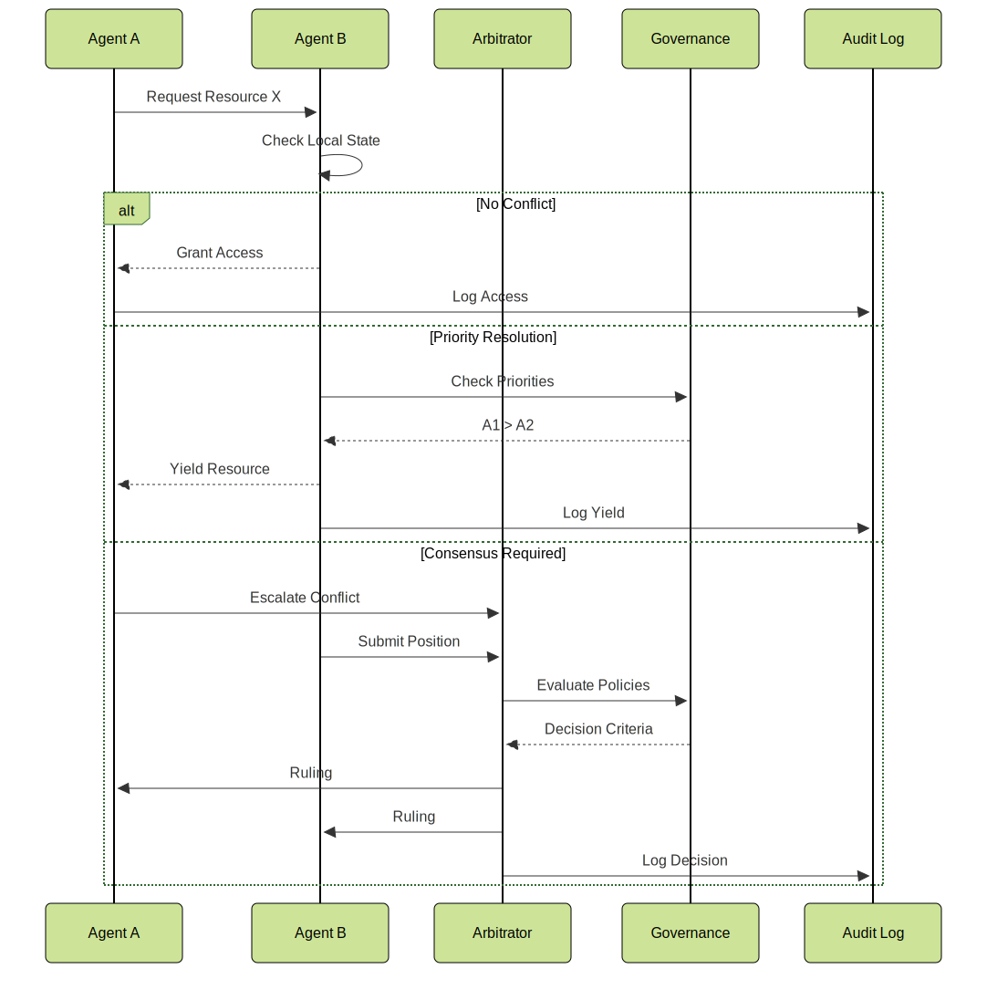

# SFAMDF Architecture Visualizations

Visual reference diagrams for the SFAMDF framework components, data flows, and security patterns.

---

## 1. High-Level Defense Architecture

---

## 2. Orchestrator-Operator Hierarchy

---

## 3. Threat Model - Compromised OODA Loop

---

## 4. AgentBound Framework

---

## 5. Defense-in-Depth Layers

---

## 6. Conflict Resolution Flow

---

## 7. Security Maturity Model

&emsp;&emsp;&emsp;&emsp;&emsp;&emsp;&emsp;&emsp;&emsp;&emsp;&emsp;&emsp;&emsp;&emsp;&emsp;&emsp;&emsp;&emsp;&emsp;&emsp;&emsp;

---

## Navigation

- [Back to SFAMDF Overview](../sfamdf/)
- [Reactive vs Proactive Comparison](../comparison/)
- [Home](../)

---

<small>
*These diagrams are designed for inclusion in the SFAMDF Whitepaper and related presentations.*
</small>
