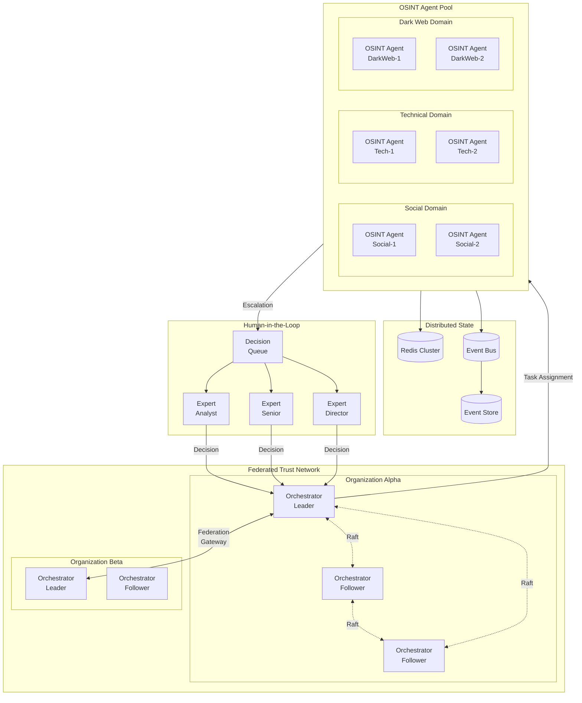
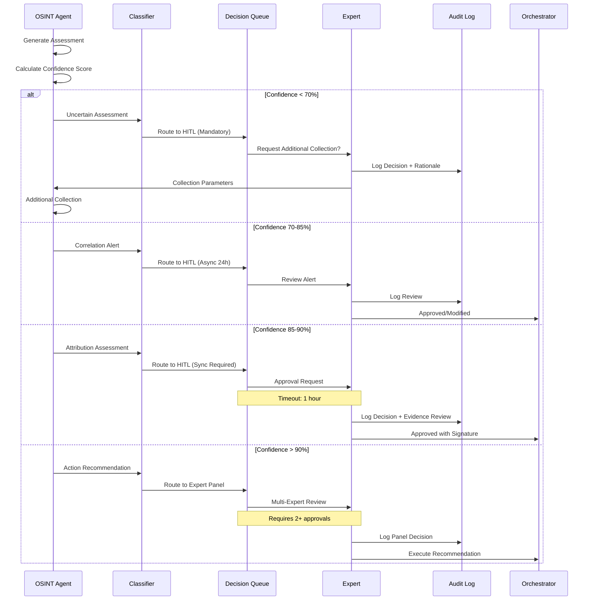
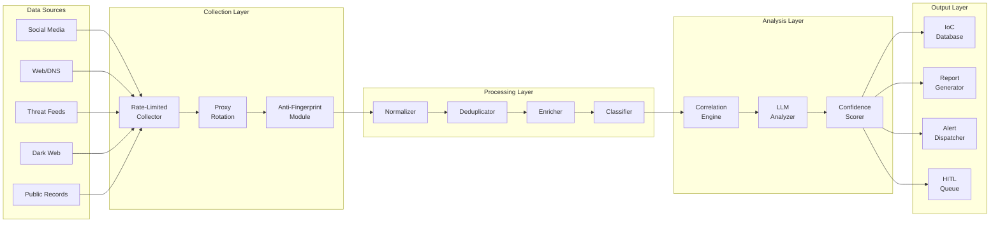

# OSINT Agent Pattern Architecture

A reference implementation pattern for distributed OSINT (Open Source Intelligence) agents within the SFAMDF framework.

---

## Overview

This pattern demonstrates how to implement a distributed OSINT collection and analysis system using SFAMDF principles:

- **Federated Orchestration** - Raft-based consensus for high availability
- **Secure Execution** - AgentBox sandboxing with policy enforcement
- **Human Oversight** - Confidence-based escalation to expert analysts
- **Resilience** - Distributed state with automatic failover

---

## 1. Distributed OSINT Agent Architecture

---

## 2. Human-in-the-Loop Decision Flow

---

## 3. OSINT Collection Pipeline

---

## 4. Security Threat Mitigations

| Threat | Mitigation |
|--------|------------|
| Poisoned Source Data | Multi-source corroboration |
| Collection Fingerprinting | Randomized patterns + proxy rotation |
| Intel Exfiltration | Volume anomaly circuit breaker |
| HITL Manipulation | MFA + dual approval requirements |
| Orchestrator Compromise | Quorum + task signature validation |

---

## 5. Resilience Patterns

**Orchestrator Failure:**
- Raft consensus elects new leader in < 1 second
- In-flight tasks redistributed to healthy nodes

**Operator Failure:**
- Checkpoint-based recovery from distributed state
- Task reassigned to healthy instance in same domain

**Expert Unavailability:**
- Timeout-based escalation chain
- Fallback to higher-authority expert pool

**Network Partition:**
- Majority partition continues operation
- Minority partition enters read-only mode

---

## Navigation

- [Back to Patterns Overview](../)
- [SFAMDF Overview](../../sfamdf/)
- [Architecture Diagrams](../../architecture/)
- [Home](../../)

---

<small>
*This pattern accompanies SFAMDF Whitepaper Appendix B: OSINT Agent Implementation*
</small>
