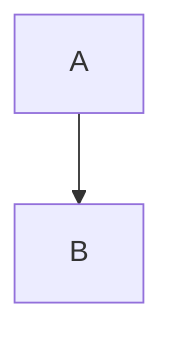

# SFAMDF GitHub Pages - Site Structure & Deployment

## Site Overview

**Purpose**: Provide immediately accessible reference material for CFP reviewers and the broader MCP security community.

**URL Structure**: `https://[org].github.io/sfamdf/`

---

## Site Map

```
sfamdf/
├── index.md                    # Main intro (created) - HIGH LEVEL BLOG POST
├── _config.yml                 # Jekyll configuration
├── whitepaper/
│   └── index.md               # Full whitepaper (or key excerpts)
├── architecture/
│   └── index.md               # Visual architecture diagrams
├── patterns/
│   ├── index.md               # Pattern overview
│   └── osint/
│       └── index.md           # OSINT agent implementation pattern
├── maturity/
│   └── index.md               # Security maturity model & self-assessment
├── comparison/
│   └── index.md               # Reactive vs Proactive comparison
└── assets/
    └── diagrams/              # Mermaid/SVG exports
```

---

## Page Purposes

| Page | Purpose | Audience |
|------|---------|----------|
| **index.md** | High-level vision, why proactive defense | CFP reviewers, general |
| **whitepaper/** | Technical depth, full framework | Security architects |
| **architecture/** | Visual reference, component diagrams | Implementers |
| **patterns/osint/** | Concrete implementation example | Practitioners |
| **maturity/** | Self-assessment, adoption roadmap | Decision makers |
| **comparison/** | Reactive vs proactive side-by-side | Skeptics, evaluators |

---

## Jekyll Configuration

```yaml
# _config.yml
title: "SFAMDF"
description: "Secure, Federated, Adaptable Multi-Agent Defense Framework"
baseurl: "/sfamdf"
url: "https://[org].github.io"

theme: minima

# Navigation
header_pages:
  - index.md
  - whitepaper/index.md
  - architecture/index.md
  - patterns/index.md
  - maturity/index.md

# Build settings
markdown: kramdown
highlighter: rouge

# Mermaid support
mermaid:
  enabled: true
```

---

## Deployment Steps

### 1. Create Repository

```bash
# Create new repo or use existing
gh repo create [org]/sfamdf --public --description "SFAMDF Framework Documentation"
```

### 2. Initialize Jekyll Site

```bash
cd sfamdf
mkdir -p whitepaper architecture patterns/osint maturity comparison assets/diagrams

# Copy content files
cp index.md .
# Add other pages...

# Create Jekyll config
cat > _config.yml << 'EOF'
title: "SFAMDF"
description: "Secure, Federated, Adaptable Multi-Agent Defense Framework"
theme: minima
EOF
```

### 3. Enable GitHub Pages

```bash
# Via GitHub UI: Settings → Pages → Source: main branch
# Or via CLI:
gh api repos/[org]/sfamdf/pages -X POST -f source='{"branch":"main","path":"/"}'
```

### 4. Verify Deployment

```bash
# Check deployment status
gh api repos/[org]/sfamdf/pages

# Expected URL
echo "Site: https://[org].github.io/sfamdf/"
```

---

## Content Priority for CFP

### Must Have Before Submission

1. **index.md** - Main intro blog post ✓ (created)
   - Vision statement
   - Core principles
   - Architecture overview
   - Reactive vs proactive comparison
   - Author info

### Nice to Have

2. **architecture/index.md** - Visual diagrams
3. **maturity/index.md** - Security maturity model

### Can Add Post-Acceptance

4. **whitepaper/index.md** - Full technical content
5. **patterns/osint/index.md** - Implementation example

---

## Link for CFP Submission

Once deployed, update CFP Description field:

**Before:**
```
Framework details: https://[org].github.io/sfamdf/
```

**After (with actual org):**
```
Framework details: https://conjectura.github.io/sfamdf/
```

Or use a custom domain if configured:
```
Framework details: https://sfamdf.conjectura.net/
```

---

## Quick Deploy (Minimal Viable Site)

For fastest deployment before CFP deadline:

```bash
# 1. Create repo
mkdir sfamdf && cd sfamdf
git init

# 2. Add minimal config
cat > _config.yml << 'EOF'
title: "SFAMDF"
description: "Secure, Federated, Adaptable Multi-Agent Defense Framework"
theme: minima
EOF

# 3. Copy main intro (index.md already created)
cp /path/to/index.md .

# 4. Commit and push
git add .
git commit -m "Initial SFAMDF introduction"
git branch -M main
git remote add origin git@github.com:[org]/sfamdf.git
git push -u origin main

# 5. Enable Pages via GitHub UI
# Settings → Pages → Source: Deploy from branch (main)
```

---

## Mermaid Diagram Rendering

GitHub Pages with `minima` theme doesn't render Mermaid by default. Options:

### Option A: Use Mermaid CDN (Recommended)

Add to `_includes/head.html`:

```html
<script src="https://cdn.jsdelivr.net/npm/mermaid/dist/mermaid.min.js"></script>
<script>mermaid.initialize({startOnLoad:true});</script>
```

### Option B: Pre-render to SVG

```bash
# Install mermaid CLI
npm install -g @mermaid-js/mermaid-cli

# Render diagrams
mmdc -i diagram.mmd -o assets/diagrams/diagram.svg
```

### Option C: Use GitHub's Native Mermaid

GitHub renders Mermaid in markdown files natively. Just use:

```markdown

```

---

## Timeline

| Date | Action |
|------|--------|
| Jan 19 | Create index.md content ✓ |
| Jan 20 | Deploy GitHub Pages site |
| Jan 21 | Verify site live, update CFP with URL |
| Jan 22 | Submit CFP before deadline |

---

*Document guides GitHub Pages deployment for CFP reviewer access.*
