# SFAMDF Architecture Visualizations

## 1. High-Level Defense Architecture

```mermaid
flowchart TB
    subgraph Users["👤 Users & Applications"]
        U1[Human Users]
        U2[Application Clients]
    end

    subgraph Orchestration["🎯 Orchestration Layer"]
        ORC[Orchestrator Agent]
        GOV[Governance Engine]
        TR[Trust Registry]
    end

    subgraph Gateway["🛡️ Security Gateway Layer"]
        PG[Policy Gateway]
        IV[Input Validator]
        OS[Output Sanitizer]
        FW[Flow Watcher]
    end

    subgraph Operators["⚙️ Operator Agent Layer"]
        direction LR
        OP1[Deterministic\nOperator]
        OP2[Generative\nOperator]
        OP3[Optimization\nOperator]
    end

    subgraph Runtime["📦 AgentBox Runtime"]
        AB1[AgentBox\nSandbox 1]
        AB2[AgentBox\nSandbox 2]
        AB3[AgentBox\nSandbox 3]
    end

    subgraph MCP["🔌 MCP Server Layer"]
        MCP1[Internal\nMCP Server]
        MCP2[Partner\nMCP Server]
        MCP3[Public\nMCP Server]
    end

    subgraph Tools["🔧 External Tools"]
        T1[(Database)]
        T2[API]
        T3[File System]
    end

    subgraph Monitoring["👁️ Security Monitoring"]
        SA[Security Agent]
        AD[Anomaly Detector]
        HP[Honeypot Tools]
        AL[Audit Logger]
    end

    U1 --> ORC
    U2 --> ORC
    ORC <--> GOV
    GOV <--> TR
    ORC --> PG
    PG --> IV
    IV --> OS
    OS --> FW
    FW --> OP1 & OP2 & OP3
    OP1 --> AB1
    OP2 --> AB2
    OP3 --> AB3
    AB1 --> MCP1
    AB2 --> MCP2
    AB3 --> MCP3
    MCP1 --> T1
    MCP2 --> T2
    MCP3 --> T3
    
    PG -.-> SA
    FW -.-> AD
    AB1 & AB2 & AB3 -.-> AL
    MCP3 -.-> HP
    SA --> AD
    AD --> AL
    HP --> SA
```

## 2. Orchestrator-Operator Hierarchy

```mermaid
flowchart TD
    subgraph Strategic["Strategic Layer"]
        O[🎯 Orchestrator Agent]
        style O fill:#2B579A,color:#fff
    end

    subgraph Tactical["Tactical Layer"]
        direction LR
        SO1[Sub-Orchestrator\nDomain A]
        SO2[Sub-Orchestrator\nDomain B]
        style SO1 fill:#5B9BD5,color:#fff
        style SO2 fill:#5B9BD5,color:#fff
    end

    subgraph Execution["Execution Layer"]
        direction LR
        subgraph Simple["Simple Operators"]
            S1[Deterministic\nFile Reader]
            S2[Deterministic\nAPI Caller]
            S3[Deterministic\nDB Query]
        end
        subgraph Complex["Complex Operators"]
            C1[Generative\nAnalyzer]
            C2[Optimization\nPlanner]
            C3[Generative\nWriter]
        end
    end

    O -->|Delegate| SO1
    O -->|Delegate| SO2
    SO1 -->|Assign| S1
    SO1 -->|Assign| S2
    SO1 -->|Assign| C1
    SO2 -->|Assign| S3
    SO2 -->|Assign| C2
    SO2 -->|Assign| C3
    
    S1 -.->|Report| SO1
    S2 -.->|Report| SO1
    C1 -.->|Report| SO1
    S3 -.->|Report| SO2
    C2 -.->|Report| SO2
    C3 -.->|Report| SO2
    SO1 -.->|Aggregate| O
    SO2 -.->|Aggregate| O
```

## 3. Threat Model - Compromised OODA Loop

```mermaid
flowchart LR
    subgraph OODA["Agent Decision Loop"]
        direction TB
        OBS[👁️ OBSERVE\nPerception]
        ORI[🧭 ORIENT\nContext]
        DEC[🧠 DECIDE\nLogic]
        ACT[⚡ ACT\nExecution]
        OBS --> ORI --> DEC --> ACT
        ACT -.->|Feedback| OBS
    end

    subgraph Attacks["Attack Vectors"]
        A1[🔴 Adversarial\nExamples]
        A2[🔴 Prompt\nInjection]
        A3[🔴 Data\nPoisoning]
        A4[🔴 Context\nManipulation]
        A5[🔴 Reward\nHacking]
        A6[🔴 Objective\nMisalignment]
        A7[🔴 Tool\nConfusion]
        A8[🔴 Output\nHijacking]
    end

    A1 -->|Corrupt| OBS
    A2 -->|Corrupt| OBS
    A3 -->|Corrupt| ORI
    A4 -->|Corrupt| ORI
    A5 -->|Corrupt| DEC
    A6 -->|Corrupt| DEC
    A7 -->|Corrupt| ACT
    A8 -->|Corrupt| ACT

    style A1 fill:#D73B3E,color:#fff
    style A2 fill:#D73B3E,color:#fff
    style A3 fill:#D73B3E,color:#fff
    style A4 fill:#D73B3E,color:#fff
    style A5 fill:#D73B3E,color:#fff
    style A6 fill:#D73B3E,color:#fff
    style A7 fill:#D73B3E,color:#fff
    style A8 fill:#D73B3E,color:#fff
```

## 4. AgentBound Framework

```mermaid
flowchart TB
    subgraph Control["Control Plane"]
        AM[📋 AgentManifest]
        TR[🔐 Trust Registry]
        PE[⚖️ Policy Engine]
    end

    subgraph Enforcement["Enforcement Plane"]
        AB[📦 AgentBox Container]
        subgraph Sandbox["Isolated Sandbox"]
            AG[Agent Process]
            MCP[MCP Client]
        end
        SC[seccomp Profile]
        AA[AppArmor Policy]
        NS[Network Filter]
    end

    subgraph Resources["Protected Resources"]
        FS[(File System)]
        NET[Network]
        IPC[IPC Channels]
    end

    AM -->|Define Permissions| PE
    TR -->|Verify Identity| PE
    PE -->|Configure| AB
    AB --> SC & AA & NS
    SC & AA & NS --> Sandbox
    AG --> MCP
    MCP -.->|Intercepted| NS
    MCP -.->|Intercepted| SC
    AG -.->|Intercepted| AA
    NS -->|Filtered| NET
    AA -->|Controlled| FS
    SC -->|Restricted| IPC

    style AM fill:#70AD47,color:#fff
    style AB fill:#5B9BD5,color:#fff
    style PE fill:#ED7D31,color:#fff
```

## 5. Defense-in-Depth Layers

## 6. Conflict Resolution Flow

## 7. Security Maturity Model

## 8. Tool Classification Matrix

## 9. Implementation Timeline

---

*These diagrams are designed for inclusion in the SFAMDF Whitepaper and related presentations.*
