# OSINT Agent Pattern Architecture Visualizations

## 1. Distributed OSINT Agent Architecture

## 2. OSINT Agent Internal Architecture (AgentBox)

## 3. Human-in-the-Loop Decision Flow

## 4. Distributed State and Failover

## 5. Federated Governance Flow

## 6. OSINT Collection Pipeline

```mermaid
flowchart LR
    subgraph Sources["Data Sources"]
        S1[🐦 Social Media]
        S2[🌐 Web/DNS]
        S3[📊 Threat Feeds]
        S4[🕳️ Dark Web]
        S5[📁 Public Records]
    end

    subgraph Collection["Collection Layer"]
        C1[Rate-Limited\nCollector]
        C2[Proxy\nRotation]
        C3[Anti-Fingerprint\nModule]
    end

    subgraph Processing["Processing Layer"]
        P1[Normalizer]
        P2[Deduplicator]
        P3[Enricher]
        P4[Classifier]
    end

    subgraph Analysis["Analysis Layer"]
        A1[Correlation\nEngine]
        A2[LLM\nAnalyzer]
        A3[Confidence\nScorer]
    end

    subgraph Output["Output Layer"]
        O1[IoC\nDatabase]
        O2[Report\nGenerator]
        O3[Alert\nDispatcher]
        O4[HITL\nQueue]
    end

    S1 & S2 & S3 & S4 & S5 --> C1
    C1 --> C2 --> C3
    C3 --> P1 --> P2 --> P3 --> P4
    P4 --> A1 --> A2 --> A3
    A3 --> O1 & O2 & O3 & O4
```

## 7. Decision Classification Matrix

## 8. Resilience Patterns

```mermaid
flowchart TB
    subgraph Orchestrators["Orchestrator Quorum (Raft)"]
        direction LR
        O1[Leader]
        O2[Follower]
        O3[Follower]
        O4[Follower]
        O5[Follower]
        O1 <--> O2 & O3 & O4 & O5
    end

    subgraph Operators["OSINT Operator Pool"]
        direction LR
        OP1[Instance 1]
        OP2[Instance 2]
        OP3[Instance 3]
        OP4[Instance N]
    end

    subgraph Experts["Expert Pool"]
        direction LR
        E1[Analyst 1]
        E2[Analyst 2]
        E3[Senior 1]
        E4[Director]
    end

    subgraph Failures["Failure Scenarios"]
        F1[❌ Leader Fails]
        F2[❌ Operator Fails]
        F3[❌ Expert Unavailable]
        F4[❌ Network Partition]
    end

    subgraph Mitigations["Automatic Mitigations"]
        M1[✅ Leader Election\n< 1 second]
        M2[✅ Task Reassignment\nCheckpoint Resume]
        M3[✅ Escalation Chain\nTimeout Routing]
        M4[✅ Quorum Operation\nMinority Read-Only]
    end

    F1 --> M1
    F2 --> M2
    F3 --> M3
    F4 --> M4

    style Failures fill:#FFEBEE,stroke:#D32F2F
    style Mitigations fill:#E8F5E9,stroke:#388E3C
```

## 9. Security Threat Mitigations

```mermaid
flowchart LR
    subgraph Threats["🔴 Threats"]
        T1[Poisoned\nSource Data]
        T2[Collection\nFingerprinting]
        T3[Intel\nExfiltration]
        T4[HITL\nManipulation]
        T5[Orchestrator\nCompromise]
    end

    subgraph Mitigations["🟢 Mitigations"]
        M1[Multi-Source\nCorroboration]
        M2[Randomized\nPatterns + Proxies]
        M3[Volume Anomaly\nCircuit Breaker]
        M4[MFA + Dual\nApproval]
        M5[Quorum + Task\nSignature Validation]
    end

    T1 --> M1
    T2 --> M2
    T3 --> M3
    T4 --> M4
    T5 --> M5

    style Threats fill:#FFCDD2,stroke:#D32F2F
    style Mitigations fill:#C8E6C9,stroke:#388E3C
```

## 10. Implementation Component Diagram

---

*These diagrams accompany SFAMDF Whitepaper Appendix B: OSINT Agent Pattern Implementation*
